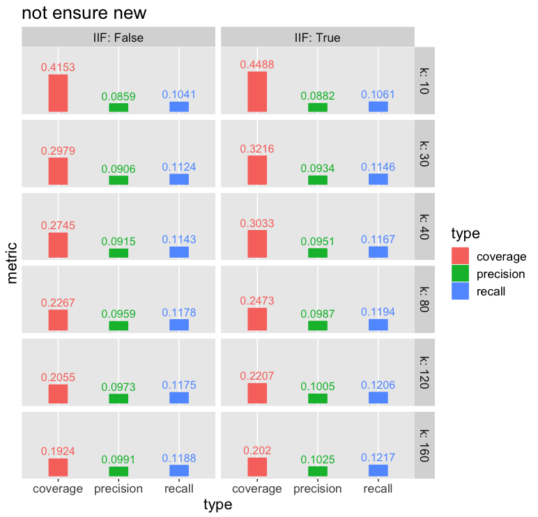
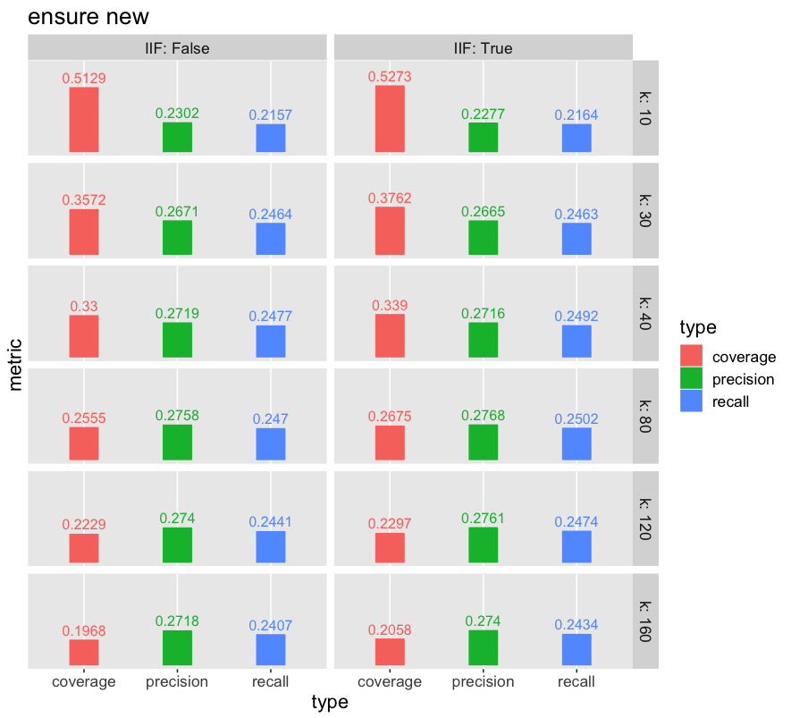
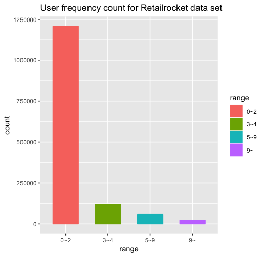
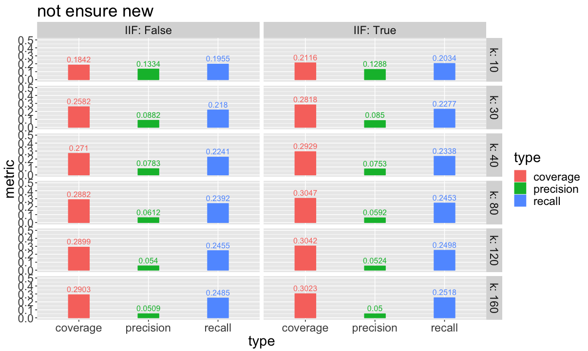

# Evaluation Results For Defferent Models
## Result of userCF
### MovieLens
#### not ensure new
Below is the result for MovieLens data set. The recommended items **is not ensured to be the totally new** item for the user.(the user may have touched the item in the training data set.) With IIF (add penalty to popular common items when increase user-user similarity) in the cosine distance, the recall and precision increase in all groups. **This proves the rationality for IIF**.

#### ensure new
If we ensure the recommended items to be new, the recall and precison will increase strikingly. This is because for movie recommend system, users seldom re-rating the moviews they have already watched. Thus if we recommend a movie that users have watched in the training data set, it is rare that these movies will show in the users' movie lists in the test set. So the recall and precision will be small. If we ensure new, the denominator of recall and precision will be smaller, since the recommended items number is smaller, while the numerator remain almost the same because of removing the already watched movies from the recommend list rarely decrese the number of common movies between the recommend list and user real list from the test data set.

#### coverage
If we decrease **k**, the coverage will increase. This is because as the number of considered most **k** collabrative users increasing, the top **n**(which is fixed) rank potential items are going to be those popular items. Since the popular items cover plenty of users. If the **k** is small, we only consider few collabrative users which are most similar to the target user, these users may have a better representation for their feature group. So the recommended items have more pertinences.
### Retailrocket
#### not ensure new
For the Retailrocket data set, the precision and recall is relatively low. Because the data set comes from E-commerce platform, there are plenty of users make few actions as is shown below.

So for new users in the test data set we cannot make recommendation merely based on userCF model. And for users that shown in the training set, most of their items lists are small, which makes it difficult for the model to have a high recall and precision.

#### ensure new
Being opposite as the MovieLens data set, if the recommended items are ensured to be new, the precision and recall will decrease. This is because unlike movie rating platform, users are much more likely to buy items that they already bought. Thus decreasing the denominator will make the numerator decrease in a relatively high proportion (one extrem case is all of one user's touched items in the test have been touched by the user in the training set).

#### coverage
The Retailrocket data set needs larger **k** to make the coverage start decreasing. Because the items number each user touch is small, if use small k, the recommended items number may even be smaller than the number of unique items in the recommend list (**n**). Thus keep increasing the k at this scope will increase the coverage. When **n** is fully met, keep increasing the **k** will decrease the coverage just as MovieLens data set has shown.
